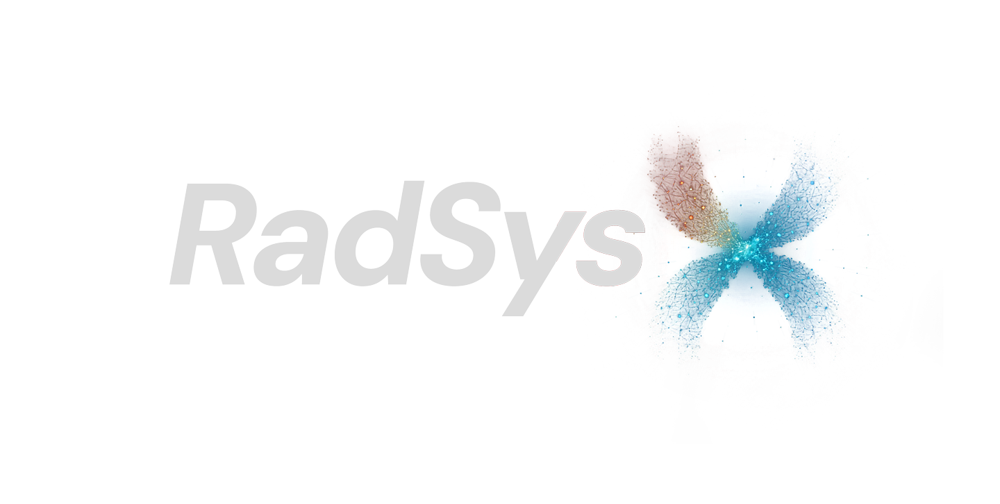

<p align="center">
  
</p>

<h1 align="center">RadSysX</h1>

<p align="center">
  Governed clinical imaging workflows, research experimentation, and agent-assisted medical reasoning.
</p>

RadSysX is a medical imaging and analysis platform with two distinct product surfaces:

- `clinical`: the governed migration target, built around FastAPI contracts, worklist-driven launch, opaque viewer sessions, audited workflow state, and a dedicated OHIF viewer runtime.
- `research`: the experimentation surface for prototype workflows, a LangGraph/deepagents-based multi-agent stack, MCP/FHIR integrations, and imaging/AI exploration that is explicitly not the clinical source of truth.

The two surfaces are not interchangeable.

## Platform Overview

The current repo contains both:

- a governed clinical platform with backend-authoritative workflow state and OHIF as the only supported clinical viewer
- a research stack with direct chat, multi-agent orchestration, MCP tool integration, and BiomedParse-oriented imaging/AI experimentation

That distinction is intentional. The clinical path is the migration target; the research path remains useful, but it does not define clinical architecture.

## Current State

The current clinical baseline on this branch is:

- FastAPI is the backend authority for clinical auth, launch, workspace, report, AI, derived-result, and audit workflows.
- OHIF is the only supported clinical viewer runtime.
- The old Next.js `/viewer` fallback route is removed.
- Backend-issued signed cookies provide local seeded clinical identity until institutional auth replaces them.
- Derived DICOM writeback stays backend-mediated through STOW.
- The local stack is designed to run as one origin through nginx, frontend, viewer, backend, and Orthanc.

The current research/agent baseline still includes:

- `backend/radsysx.py` for multi-agent orchestration
- `backend/chat_interface.py` for direct LLM chat
- `backend/mcp/*` for MCP/FHIR tooling and server installation
- `backend/biomedparse_api.py` for research imaging analysis APIs

Those capabilities remain part of RadSysX, but they are not the clinical source of truth.

## Clinical Workflow

1. `POST /api/auth/local-login`
2. `GET /api/auth/session`
3. Open `/worklist`
4. `POST /api/imaging/launch`
5. Open `/viewer?launch=...`
6. `GET /api/imaging/launch/resolve`
7. OHIF binds to the returned runtime and same-origin DICOMweb roots
8. `GET /api/studies/{studyUid}/workspace`
9. Persist reports, AI jobs, derived results, and audit through backend contracts
10. Persist uploaded derived DICOM through `POST /api/derived-results/stow`

## Architecture

### Clinical authority

- `backend/server.py`
- `backend/clinical/*`
- `backend/tests/test_clinical_platform.py`

### Research and agent stack

- `backend/radsysx.py`
- `backend/chat_interface.py`
- `backend/mcp/*`
- `backend/biomedparse_api.py`
- `backend/tools/*`

### Shared browser clinical package

- `packages/clinical-web/*`

### Next.js shell

- `frontend/app/login/page.tsx`
- `frontend/app/worklist/page.tsx`
- `frontend/app/page.tsx`

### Dedicated OHIF viewer

- `viewer/scripts/build-ohif-dist.mjs`
- `viewer/assets/radsysx-bootstrap.js`
- `viewer/assets/radsysx-ohif-extension.js`
- `viewer/assets/radsysx-ohif-mode.js`
- `viewer/assets/radsysx-viewer.css`

### Local one-origin stack

- `docker-compose.yml`
- `deploy/clinical-stack/*`

## Research and Agent Capabilities

### Multi-agent orchestration

The research surface still includes a LangGraph/deepagents-style multi-agent stack in `backend/radsysx.py`, with a supervisor coordinating specialist agents for:

1. pharmacist reasoning
2. researcher/literature workflows
3. medical analyst workflows

### Chat and MCP

The repo still supports:

- direct chat via `backend/chat_interface.py`
- MCP-backed tool discovery and execution
- FHIR-oriented MCP tools in `backend/mcp/fhir_server.py`
- MCP installation flows in `backend/mcp/installer.py`

### Research imaging and AI

Research-only imaging/AI experimentation still includes:

- BiomedParse-oriented APIs in `backend/biomedparse_api.py`
- prototype imaging upload/analyze routes in the Next.js research surface
- legacy viewer components kept for experimentation and parity work, not as the clinical viewer target

## Key Endpoints

### Clinical

- `GET /api/auth/session`
- `POST /api/auth/local-login`
- `POST /api/auth/logout`
- `GET /api/platform/config`
- `GET /api/worklist`
- `POST /api/imaging/launch`
- `GET /api/imaging/launch/resolve`
- `GET /api/studies/{studyUid}/workspace`
- `POST /api/reports/draft`
- `POST /api/ai/jobs`
- `POST /api/derived-results`
- `POST /api/derived-results/stow`
- `GET /api/audit/studies/{studyUid}`

### Research / agent

- `POST /process`
- `POST /stream`
- `GET /stream`
- `POST /chat`
- `POST /chat/stream`
- `GET /tools`
- `POST /execute_tool`
- `POST /fhir/tool`
- `GET /mcp/status`
- `POST /mcp/toggle`
- `POST /mcp/install`

## Runtime Modes

Mode is controlled by `RADSYSX_APP_MODE`:

- `research`
- `pilot`
- `clinical`

Rules:

- Only `research` may expose experimental upload/analyze flows.
- `pilot` and `clinical` use the clinical FastAPI surface and OHIF viewer flow.
- Governed flows must not send DICOM bytes directly from the browser to third-party AI services.

## Environment

The most important clinical env vars are:

- `RADSYSX_APP_MODE`
- `RADSYSX_AUTH_MODE`
- `RADSYSX_CLINICAL_API_SECRET`
- `RADSYSX_SESSION_SECRET`
- `RADSYSX_SESSION_COOKIE_SECURE`
- `RADSYSX_VIEWER_BASE_URL`
- `RADSYSX_VIEWER_BASE_PATH`
- `RADSYSX_DICOMWEB_PUBLIC_BASE_URL`
- `RADSYSX_ORTHANC_DICOMWEB_URL`
- `RADSYSX_ORTHANC_USERNAME`
- `RADSYSX_ORTHANC_PASSWORD`
- `NEXT_PUBLIC_RADSYSX_APP_MODE`
- `NEXT_PUBLIC_BACKEND_URL`
- `NEXT_PUBLIC_VIEWER_BASE_URL`

Research-only integrations such as MCP/FHIR tools and BiomedParse still exist, but they do not define the clinical architecture.

## Local Development

### Install

```bash
npm install --legacy-peer-deps
```

Backend dependencies are managed from `backend/requirements.txt`.

### Run backend directly

```bash
python3 backend/server.py
```

### Run the research shell directly

```bash
npm run dev --workspace frontend
```

### Focused backend checks

```bash
python3 -m compileall backend/clinical backend/server.py backend/radsysx.py
python3 -m pytest backend/tests/test_clinical_platform.py
```

### Frontend and viewer checks

```bash
npm run type-check --workspace frontend
npm run type-check --workspace viewer
npm run build --workspace viewer
```

### Run the local one-origin stack

Set explicit Orthanc credentials first:

```bash
export RADSYSX_ORTHANC_USERNAME=local-user
export RADSYSX_ORTHANC_PASSWORD=local-pass
docker compose up --build
```

Public routes:

- shell: [http://localhost:3000](http://localhost:3000)
- worklist: [http://localhost:3000/worklist](http://localhost:3000/worklist)
- viewer: [http://localhost:3000/viewer](http://localhost:3000/viewer)
- API: [http://localhost:3000/api](http://localhost:3000/api)
- DICOMweb: [http://localhost:3000/dicom-web](http://localhost:3000/dicom-web)

## Guidance

The authoritative contributor guidance is:

- [AGENTS.md](AGENTS.md)

The current execution checklist for the next clinical tranche is:

- [PHASE4_CLINICAL_EXECUTION_CHECKLIST.md](PHASE4_CLINICAL_EXECUTION_CHECKLIST.md)

## Near-Term Roadmap

The next major clinical tasks are:

1. Keep docs and runtime guidance aligned with the shipped RadSysX architecture.
2. Deepen the RadSysX OHIF extension/mode implementation.
3. Wire OHIF measurement tracking and segmentation into governed SR/SEG export and reload flows.
4. Validate the full local nginx + frontend + viewer + backend + Orthanc stack end to end.
5. Move from seeded local identity to institutional identity/context.
